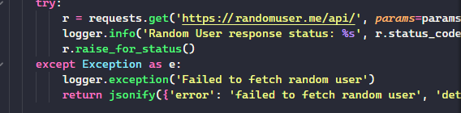
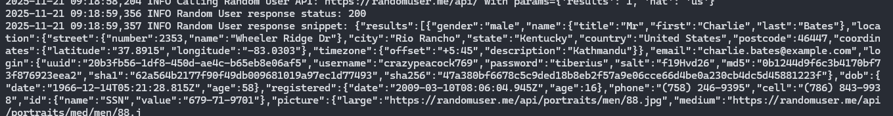
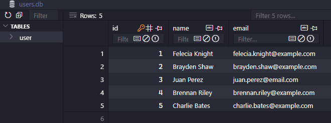

# Fetch Simulation — CRUD de Usuarios

Aplicación Flask simple que expone un CRUD de usuarios usando SQLite.

**Prerequisitos**

- **Python 3.8+** (recomendado 3.10 o superior). Descarga e instalador: https://www.python.org/downloads/
- **pip** (viene incluido con las distribuciones oficiales de Python).
- **Entorno virtual (recomendado)**: `venv` (incluido con Python) o `virtualenv`.
- **Opcional — Editor**: Visual Studio Code — https://code.visualstudio.com/
- **Opcional — Git**: para clonar el repositorio — https://git-scm.com/downloads

Guías y tutoriales recomendados:

- Instalación de Python en Windows (documentación oficial): https://docs.python.org/3/using/windows.html
- Crear y usar entornos virtuales en Python (guía práctica): https://realpython.com/python-virtual-environments-a-primer/
- Guía rápida para empezar con Python: https://www.python.org/about/gettingstarted/


## Instalación del proyecto

Comandos rápidos (PowerShell) — ejemplo para Windows:

```pwsh
# Crear y activar un entorno virtual
python -m venv .venv
.\.venv\Scripts\Activate.ps1

# Instalar dependencias
pip install -r requirements.txt

# Ejecutar la aplicación
python run.py
```

La app quedará en `http://127.0.0.1:5000/`. El botón "Generar usuario" trae un usuario desde `randomuser.me` usando `requests` en el servidor para evitar CORS.

Si prefieres no usar `Flask-SQLAlchemy`, puedo adaptar la app para usar la librería estándar `sqlite3`.

## Resultados

- Captura 1 — Petición desde el cliente al endpoint `/api/generate` 



- Captura 2 — Respuesta recibida desde `randomuser.me` (JSON) antes de guardarla en la BD



- Captura 3 — Registros en la base de datos después de la inserción (ej. salida de `GET /api/users`)


